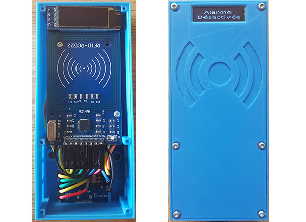

# RFID reader deal with MQTT server and display status on OLED Screen

## Requirements

* Wemos D1 mini
* MFRC522 RFID Reader
* 0.91 SSD1306 Oled Screen
* Jumpers Wire
* Screws
* 3D printer

## Copyright

This project is licensed under the MIT License - see the [license](LICENSE) file for details.